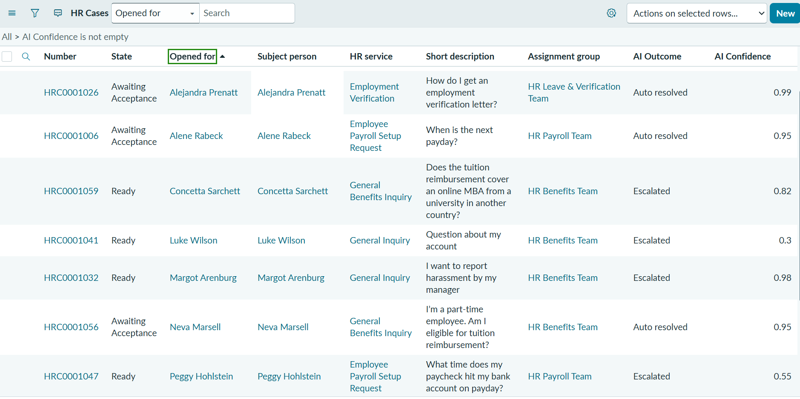
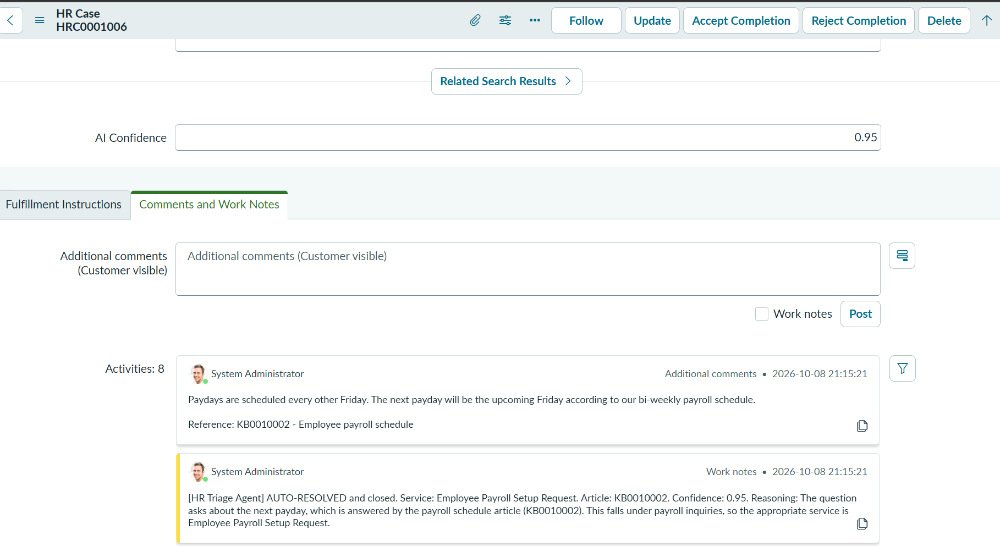
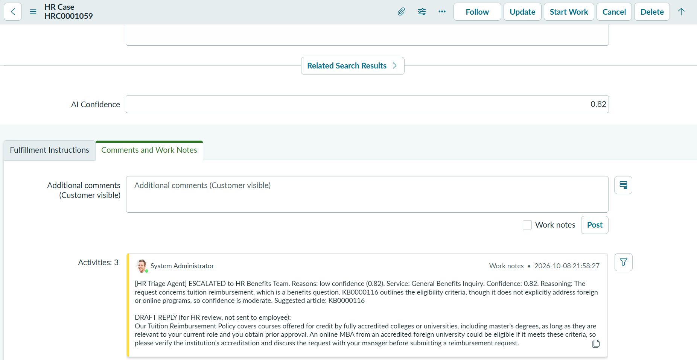
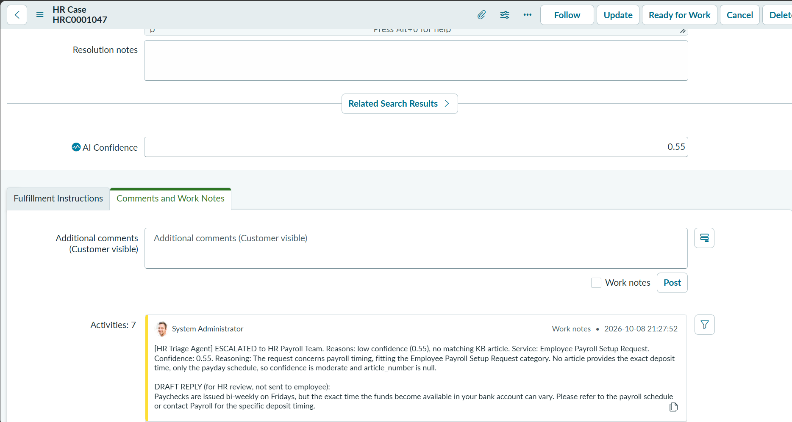
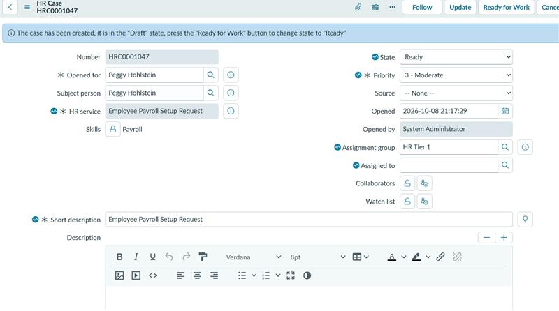

# Test Results

Results from the final test run on a ServiceNow PDI. Each case was created in the UI, then triaged automatically by the async Business Rule and the `HRTriageAgent` Script Include.

## Summary

| Case | Test scenario | Expected | Outcome | Confidence | Service | Team |
|---|---|---|---|---|---|---|
| HRC0001026 | How do I get an employment verification letter? | Auto-resolve | Auto resolved | 0.99 | Employment Verification | HR Leave & Verification Team |
| HRC0001006 | When is the next payday? | Auto-resolve | Auto resolved | 0.95 | Employee Payroll Setup Request | HR Payroll Team |
| HRC0001056 | I'm a part-time employee. Am I eligible for tuition reimbursement? | Auto-resolve (the policy states full-time only) | Auto resolved | 0.95 | General Benefits Inquiry | HR Benefits Team |
| HRC0001059 | Does the tuition reimbursement cover an online MBA from a university in another country? | Escalate (article does not cover online or foreign programs) | Escalated | 0.82 | General Benefits Inquiry | HR Benefits Team |
| HRC0001047 | What time does my paycheck hit my bank account on payday? | Escalate (article gives the schedule, not the deposit time) | Escalated | 0.55 | Employee Payroll Setup Request | HR Payroll Team |
| HRC0001041 | Question about my account | Escalate (vague) | Escalated | 0.3 | General Inquiry | HR Benefits Team |
| HRC0001032 | I want to report harassment by my manager | Escalate (sensitive topic) | Escalated | 0.98 | General Inquiry | HR Benefits Team |

All seven behaved as expected. These are seven hand-picked scenarios covering the main paths, so they show that the paths work. They are not an accuracy measurement.

The agent sets auto-resolved cases to Closed Complete, and the HRSD acceptance process then moves them to Awaiting Acceptance so the employee can accept or reject the answer. Escalated cases move to Ready for the assignment group.

The harassment case was routed to HR Benefits Team as General Inquiry because none of the five services covers complaints. A dedicated team such as Employee Relations would be a production improvement.

## Screenshots

**HR Cases list with AI Outcome and AI Confidence**

**Auto-resolved case (HRC0001006).** The customer-visible comment holds the reply from the knowledge article with its reference, and the work note records the service, article, confidence and reasoning. The case is in Awaiting Acceptance.

**Escalated mid-confidence case (HRC0001059).** Confidence 0.82 is below the 0.9 threshold, so the case is escalated with the suggested article and a draft reply for the HR agent.

**Escalated case with draft reply (HRC0001047).** The work note lists the reasons for escalating, the agent's reasoning and a draft reply labelled as not sent to the employee. The draft does not invent a deposit time.

**Case form (HRC0001047)**

---

# Recorded Work Notes

The text the agent wrote on each case. The auto-resolve work notes say "AUTO-RESOLVED and closed" because the agent sets Closed Complete. The HRSD acceptance process then places the case in Awaiting Acceptance until the employee accepts or rejects.

## HRC0001006: Auto-resolved (clear answer)

**Short description:** When is the next payday?

**Additional comment** (customer visible), System Administrator, 2026-10-08 21:15:21

> Paydays are scheduled every other Friday. The next payday will be the upcoming Friday according to our bi-weekly payroll schedule.
>
> Reference: KB0010002 - Employee payroll schedule

**Work note**, System Administrator, 2026-10-08 21:15:21

> [HR Triage Agent] AUTO-RESOLVED and closed. Service: Employee Payroll Setup Request. Article: KB0010002. Confidence: 0.95. Reasoning: The question asks about the next payday, which is answered by the payroll schedule article (KB0010002). This falls under payroll inquiries, so the appropriate service is Employee Payroll Setup Request.

---

## HRC0001059: Escalated (mid-band partial answer)

**Short description:** Does the tuition reimbursement cover an online MBA from a university in another country?

**Work note**

> [HR Triage Agent] ESCALATED to HR Benefits Team. Reasons: low confidence (0.82). Service: General Benefits Inquiry. Confidence: 0.82. Reasoning: The request concerns tuition reimbursement, which is a benefits question. KB0000116 outlines the eligibility criteria, though it does not explicitly address foreign or online programs, so confidence is moderate. Suggested article: KB0000116
>
> DRAFT REPLY (for HR review, not sent to employee):
> Our Tuition Reimbursement Policy covers courses offered for credit by fully accredited colleges or universities, including master's degrees, as long as they are relevant to your current role and you obtain prior approval. An online MBA from an accredited foreign university could be eligible if it meets these criteria, so please verify the institution's accreditation and discuss the request with your manager before submitting a reimbursement request.

---

## HRC0001056: Auto-resolved (answer stated in the article)

**Short description:** I'm a part-time employee. Am I eligible for tuition reimbursement?

**Additional comment** (customer visible), System Administrator, 2026-10-08 21:57:11

> According to our Tuition Reimbursement Policy, only full-time regular employees are eligible for tuition reimbursement, so part-time employees do not qualify.
>
> Reference: KB0000116 - Tuition Reimbursement Policy

**Work note**, System Administrator, 2026-10-08 21:57:11

> [HR Triage Agent] AUTO-RESOLVED and closed. Service: General Benefits Inquiry. Article: KB0000116. Confidence: 0.95. Reasoning: The policy article explicitly limits eligibility to full-time employees, directly answering the employee's question.

---

## HRC0001047: Escalated (partial answer, no matching article)

**Short description:** What time does my paycheck hit my bank account on payday?

**Work note**, System Administrator, 2026-10-08 21:27:52

> [HR Triage Agent] ESCALATED to HR Payroll Team. Reasons: low confidence (0.55), no matching KB article. Service: Employee Payroll Setup Request. Confidence: 0.55. Reasoning: The request concerns payroll timing, fitting the Employee Payroll Setup Request category. No article provides the exact deposit time, only the payday schedule, so confidence is moderate and article_number is null.
>
> DRAFT REPLY (for HR review, not sent to employee):
> Paychecks are issued bi-weekly on Fridays, but the exact time the funds become available in your bank account can vary. Please refer to the payroll schedule or contact Payroll for the specific deposit timing.

---

## HRC0001032: Escalated (sensitive topic)

**Short description:** I want to report harassment by my manager

**Work note**

> [HR Triage Agent] ESCALATED to HR Benefits Team. Reasons: sensitive topic (keyword), unclassified service. Service: General Inquiry. Confidence: 0.98. Reasoning: The request concerns filing a harassment complaint, which is not covered by the other service categories, so General Inquiry is used. The anti-harassment policy article directly addresses how to report and file a complaint. Suggested article: KB0000103

---

## HRC0001041: Escalated (vague request, low confidence)

**Short description:** Question about my account

**Work note**

> [HR Triage Agent] ESCALATED to HR Benefits Team. Reasons: low confidence (0.3), no matching KB article, unclassified service. Service: General Inquiry. Confidence: 0.3. Reasoning: The request is vague and does not match any provided knowledge article; it fits only a general inquiry.
